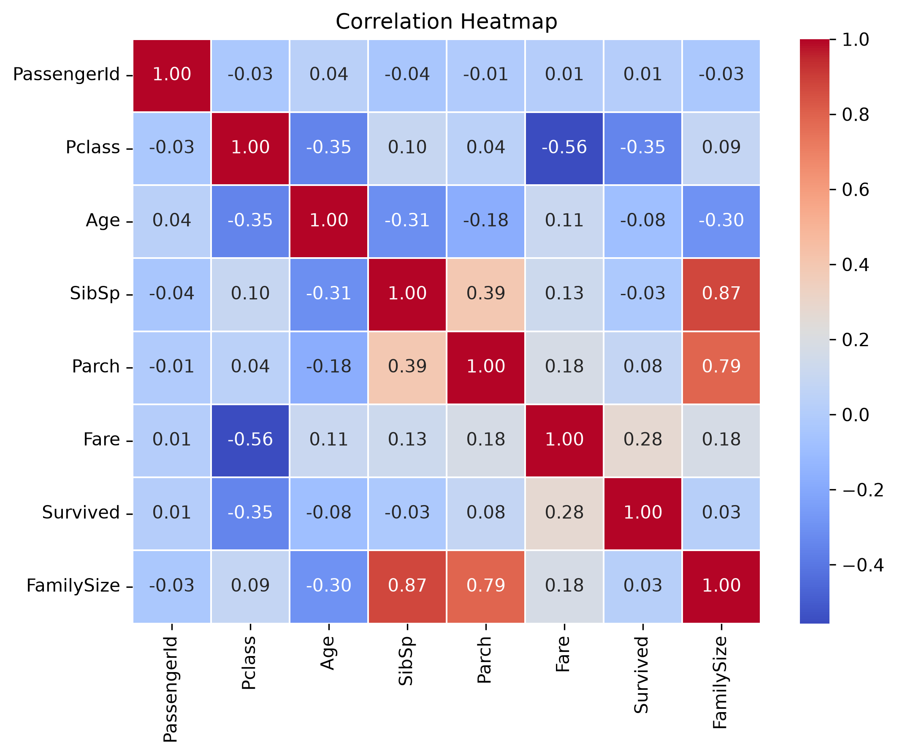

# 🚢 Titanic Survival Prediction

## Overview

This project predicts whether a passenger survived the Titanic disaster using **Logistic Regression**. It demonstrates a complete end-to-end machine learning workflow, including data exploration, preprocessing, feature engineering, model training, hyperparameter tuning, evaluation, and model persistence.

The project was built using the Titanic dataset from Kaggle and follows industry-standard Scikit-Learn practices such as preprocessing pipelines and cross-validation.

---

# Project Workflow

* Data Loading
* Exploratory Data Analysis (EDA)
* Feature Engineering
* Data Preprocessing Pipeline
* Model Training
* Cross-Validation
* Hyperparameter Tuning (GridSearchCV)
* Model Evaluation
* Model Interpretatione

---

# Dataset

The project uses the Titanic dataset containing passenger information such as:

* Passenger Class
* Sex
* Age
* Fare
* Embarked
* Family Size

Target Variable:

* Survived (0 = No, 1 = Yes)

---

# Exploratory Data Analysis

The following analyses were performed:

* Target variable distribution
* Numerical feature distributions
* Categorical feature distributions
* Survival analysis across different features
* Correlation analysis
* Family Size feature engineering

## Correlation Heatmap

To better understand the relationships between the numerical features, a Pearson correlation heatmap was generated during the Exploratory Data Analysis (EDA) phase.

The heatmap highlights:

- Positive and negative correlations between numerical features.
- Features that are strongly associated with the target variable (`Survived`).
- Potential multicollinearity before model training.

### Correlation Heatmap



### Key Observations

- `Fare` shows a positive correlation with passenger survival.
- `Pclass` is negatively correlated with survival, indicating that passengers in higher classes were more likely to survive.
- `Age` has a weak negative correlation with survival.
- No severe multicollinearity was observed among the numerical features.

---

# Data Preprocessing

Implemented an automated preprocessing pipeline using Scikit-Learn.

### Numerical Pipeline

* Median Imputation
* Standard Scaling

### Categorical Pipeline

* Most Frequent Imputation
* One-Hot Encoding
* ColumnTransformer

---

# Model

Algorithm:

* Logistic Regression

Hyperparameter Tuning:

* GridSearchCV
* 5-Fold Cross Validation

Best Hyperparameter:

```text
C = 0.1
```

---

# Model Performance

| Metric                    | Score  |
| ------------------------- | ------ |
| Training Accuracy         | 78.37% |
| Cross Validation Accuracy | 78.52% |
| Test Accuracy             | 77.65% |

---

# Key Findings

* Passenger sex was the strongest predictor of survival.
* Higher fares were associated with higher survival probability.
* Older passengers had a slightly lower chance of survival.
* The Logistic Regression model generalized well with minimal overfitting.

---

# Technologies Used

* Python
* Pandas
* NumPy
* Matplotlib
* Scikit-Learn

---

# How to Run

Clone the repository:

```bash
git clone <https://github.com/Parth385/titanic-survival-prediction.git>
```

Install dependencies:

```bash
pip install -r requirements.txt
```

Open the notebook:

```text
notebooks/titanic_survival.ipynb
```

---


# Example Predictions

After training, the preprocessing pipeline and Logistic Regression model were saved using **Joblib**. The saved artifacts can be loaded later to make predictions on new passenger information without retraining the model.

The following examples demonstrate predictions on two well-known fictional characters from the Titanic movie.

## Example 1 – Jack Dawson

**Passenger Information**

| Feature | Value |
|---------|-------|
| Passenger Class | 3 |
| Sex | Male |
| Age | 20 |
| Fare | 7.25 |
| Embarked | Southampton (S) |

**Prediction**

```text
Prediction : Did Not Survive

Probability of Survival     : 17.59%
Probability of Not Survival : 82.41%
```

---

## Example 2 – Rose DeWitt Bukater

**Passenger Information**

| Feature | Value |
|---------|-------|
| Passenger Class | 1 |
| Sex | Female |
| Age | 17 |
| Fare | 512.00 |
| Embarked | Southampton (S) |

**Prediction**

```text
Prediction : Survived

Probability of Survival     : 99.74%
Probability of Not Survival : 0.26%
```

---

These predictions demonstrate how the trained machine learning pipeline can be reused to classify completely new passenger records while automatically applying the same preprocessing steps used during training.

---

# Future Improvements

* Compare additional machine learning models such as Random Forest and XGBoost.
* Deploy the model using FastAPI or Streamlit.
* Build a web interface for real-time predictions.

---

# Author

**Parth Sharma**
